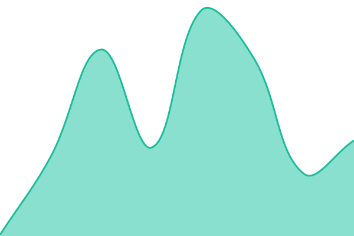
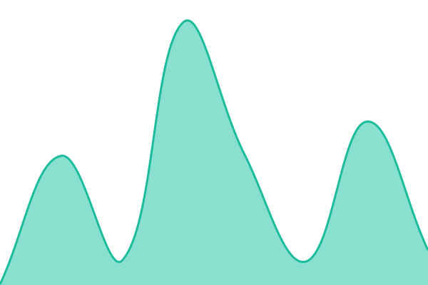

# Statio

<!--start: description-->

**Statio** is an uptime monitor and status page, powered entirely by GitHub Actions, Issues, and Pages. It is built on [Upptime](https://upptime.js.org), the open-source uptime monitor made with 💚 by [Anand Chowdhary](https://anandchowdhary.com).

  
<strong>Statio</strong> helps you know when your endpoints go down.

Statio runs scheduled checks using GitHub Actions (as often as every 5 minutes) to ping your endpoints and verify they're online. Response time data is recorded and committed to git, enabling long-term trend charts and historical insights. When downtime is detected, GitHub Issues are automatically opened and closed. A status page built with Svelte is hosted via GitHub Pages and shows uptime, response times, and incident history.

It is completely free if you're already using GitHub since there's no external server or subscription needed. All configuration lives in a single file, and your data is gone if you delete the repo. Plus, you get a git-native audit trail for all changes and events.

Statio is powered by [Upptime](https://upptime.js.org), an open-source project created by [Anand Chowdhary](https://anandchowdhary.com).

<!--end: description-->

## [📈 Live Status](https://achmadalifn4.github.io/Statio): <!--live status--> **🟩 All systems operational**

<!--start: status pages-->
<!-- This summary is generated by Upptime (https://github.com/achmadalifn4/Statio) -->
<!-- Do not edit this manually, your changes will be overwritten -->
<!-- prettier-ignore -->
| URL | Status | History | Response Time | Uptime |
| --- | ------ | ------- | ------------- | ------ |
|  [Google](https://www.google.com) | 🟩 Up | [google.yml](https://github.com/achmadalifn4/Statio/commits/HEAD/history/google.yml) | 

 115ms
     
 | 

<a href="https://achmadalifn4.github.io/Statio/history/google">98.77%</a>
    

|  [Wikipedia](https://en.wikipedia.org) | 🟩 Up | [wikipedia.yml](https://github.com/achmadalifn4/Statio/commits/HEAD/history/wikipedia.yml) | 

 197ms
     
 | 

<a href="https://achmadalifn4.github.io/Statio/history/wikipedia">100.00%</a>
    

|  [Hacker News](https://news.ycombinator.com) | 🟩 Up | [hacker-news.yml](https://github.com/achmadalifn4/Statio/commits/HEAD/history/hacker-news.yml) | 

 229ms
     
 | 

<a href="https://achmadalifn4.github.io/Statio/history/hacker-news">100.00%</a>
    

|  Secret Site | 🟩 Up | [secret-site.yml](https://github.com/achmadalifn4/Statio/commits/HEAD/history/secret-site.yml) | 

 45ms
     
 | 

<a href="https://achmadalifn4.github.io/Statio/history/secret-site">100.00%</a>
    

<!--end: status pages-->

<!--start: docs-->

## ⭐ How it works

- GitHub Actions is used as an uptime monitor
  - Every 5 minutes, a workflow visits your website to make sure it's up
  - Response time is recorded every 6 hours and committed to git
  - Graphs of response time are generated every day
- GitHub Issues is used for incident reports
  - An issue is opened if an endpoint is down
  - People from your team are assigned to the issue
  - Incidents reports are posted as issue comments
  - Issues are locked so non-members cannot comment on them
  - Issues are closed automatically when your site comes back up
  - Slack notifications are sent on updates
- GitHub Pages is used for the status website
  - A simple, beautiful, and accessible PWA is generated
  - Built with Svelte and Sapper
  - Fetches data from this repository using the GitHub API

_Upptime is not affiliated to or endorsed by GitHub._

## 🚀 Deploy to Tencent EdgeOne Makers

In addition to GitHub Pages, this status page's built static site can also be mirrored to [Tencent EdgeOne Pages](https://pages.edgeone.ai) (part of the [EdgeOne Makers](https://edgeone.ai/makers) program for open-source projects), so it's served from EdgeOne's global edge network.

1. **Get an EdgeOne API token** — sign in to the [EdgeOne Pages console](https://console.tencentcloud.com/edgeone/pages) and generate an API token.
2. **Add the token as a repo secret** — in this repository, go to `Settings > Secrets and variables > Actions` and create a secret named `EDGEONE_API_TOKEN` with that value.
3. *(Optional)* **Set a project name** — add a repository variable `EDGEONE_PROJECT_NAME` (same `Actions` settings page, under `Variables`) to control the EdgeOne Pages project name; it defaults to the repo name if not set.
4. **Let Upptime build the site** — the existing `Static Site CI` workflow ([.github/workflows/site.yml](.github/workflows/site.yml)) builds the status page and publishes it to the `gh-pages` branch, as usual.
5. **Deploy to EdgeOne** — once `Static Site CI` finishes, the [EdgeOne Pages Deploy](.github/workflows/edgeone-deploy.yml) workflow automatically checks out `gh-pages` and runs `npx edgeone pages deploy` to publish it to EdgeOne Pages. You can also trigger it manually from the **Actions** tab (`workflow_dispatch`).

Once deployed, your live EdgeOne Pages URL is shown in the EdgeOne Pages console/dashboard for the project.

## 👩‍💻 [Documentation](https://upptime.js.org)

1. [How it works](https://upptime.js.org/docs)
1. [Getting started](https://upptime.js.org/docs/get-started)
1. [Configuration](https://upptime.js.org/docs/configuration)
1. [Triggers](https://upptime.js.org/docs/triggers)
1. [Notifications](https://upptime.js.org/docs/notifications)
1. [Badges](https://upptime.js.org/docs/badges)
1. [Packages](https://upptime.js.org/docs/packages)
1. [Contributing](https://upptime.js.org/docs/contributing)
1. [Frequently Asked Questions](https://upptime.js.org/docs/faq)

### Concepts

#### Issues as incidents

When the GitHub Actions workflow detects that one of your URLs is down, it automatically opens a GitHub issue ([example issue #67](https://github.com/achmadalifn4/Statio/issues/67)). You can add incident reports to this issue by adding comments. When your site comes back up, the issue will be closed automatically as well.

<table>
  <tr>
    <td>
      
    </td>
    <td>
      
    </td>
  </tr>
</table>

#### Commits for response time

Four times per day, another workflow runs and records the response time of your websites. This data is committed to GitHub, so it's available in the commit history of each file ([example commit history](https://github.com/koj-co/upptime/commits/master/history/wikipedia.yml)). Then, the GitHub API is used to graph the response time history of each endpoint and to track when a site went down.

<table>
  <tr>
    <td>
      
    </td>
    <td>
      
    </td>
  </tr>
</table>
<!--end: docs-->

## 📄 License

- Code: [MIT](./LICENSE) © [Anand Chowdhary](https://anandchowdhary.com)
- Data in the `./history` directory: [Open Database License](https://opendatacommons.org/licenses/odbl/1-0/)
